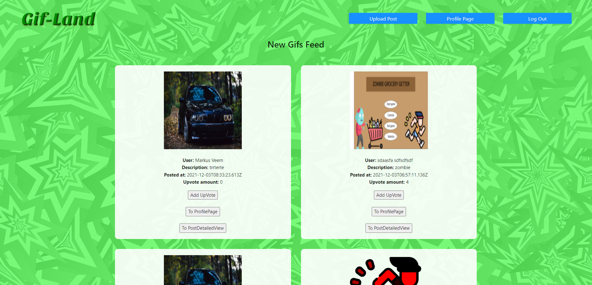
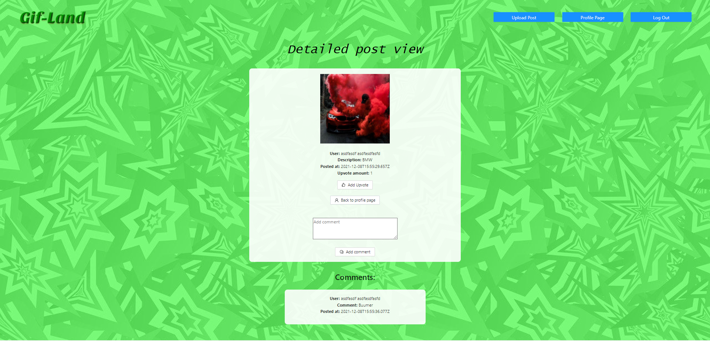

# Project Name: Gif-land
### Autorid: Hans-Märten Liiu ja Jan-Erik Läänesaar
 

Algne Idee:
-------------

Lehel eksisteerib sisse-, ja välja logimise võimalus. Kasutajad saavad üles laadida enda poolt valitud .gif failisid. Teised kasutajad saavad üksteise gif-isid meeldivaks märkida ning saavad neile omalt poolt kommentaare lisada. 
 
 
Kui arendus nende põhifunktsionaalsustega ilusti lõpuni jõuab, oleks järgmine eesmärk luua profiilide süsteem, kus saaks näha mõne konkreetse kasutaja poolt kõiki üleslaetud gif-e, ning kus saaks ka antud kasutajat jälgima hakata. Esialgses versioonis kuvame kõikide kasutajate poolt tehtud postitused ühisel lehel, küll aga oleks lõppeesmärk kuvada iga kasutaja jaoks eraldi voolehte, kus ta näeks vaid tema enda poolt jälgitud kasutajate postitusi. 
 

## Rakenduse funktsionaalne kirjeldus:
* Sisse ja välja logimise funktsionaalsus
* NavBari kaudu saab liikuda erinevate komponentide vahel
* Gif-ide Üleslaadimise funktsionaalsus (Toimib kasutades lisa serverit, mida hetkel peab käsitsi käivitama)
* Gif-ide kuvamise funktsionaalsus(responsive disain)
* Profiili leht endale
* Teiste kasutajate Profiili leht
* Postituse detailne vaade
* Postituse kommenteerimise võimalus
* News Feed kõigile kasutajatele
* News Feed sisselogitud kasutajatele
 

## Rakenduse kuvatõmmised
* HomePage

* Login Page

* Registration Page

* Gif-Upload page

* Post's for all users

* Post's for logged in User

* Post's Detailed View

* My ProfilePage

* Other Person's profilePage

 

## Testid
* Backendi testi käivitamiseks tuleb rakendus dockeris käivitada ning dockeri Command Lines öelda käsk npm test
* FrontEndi testide jaoks on vaja kommenteerida failides PictureLoader, PictureLoaderAll, ProfilePictureLoader, OtherProfilePage, PostDetailedView välja piltide importimine ning see järel on võimalik öelda dockeri command lines npm test. (Lisame ka pildi illustreerimaks, mis osa tuleb välja kommenteerida, et rakenduse testimisel ei tekiks errorit)

 

## Wireframe kuvatõmmised

 

## Pisipildid, logod, animatsioonid jms on võetud järgnevatelt lehtedelt:
* https://www.flaticon.com/
* https://maketext.io/
* https://loading.io/css
* https://favicon.io/
* https://pixabay.com/illustrations/green-pattern-background-wallpaper-2696878/

