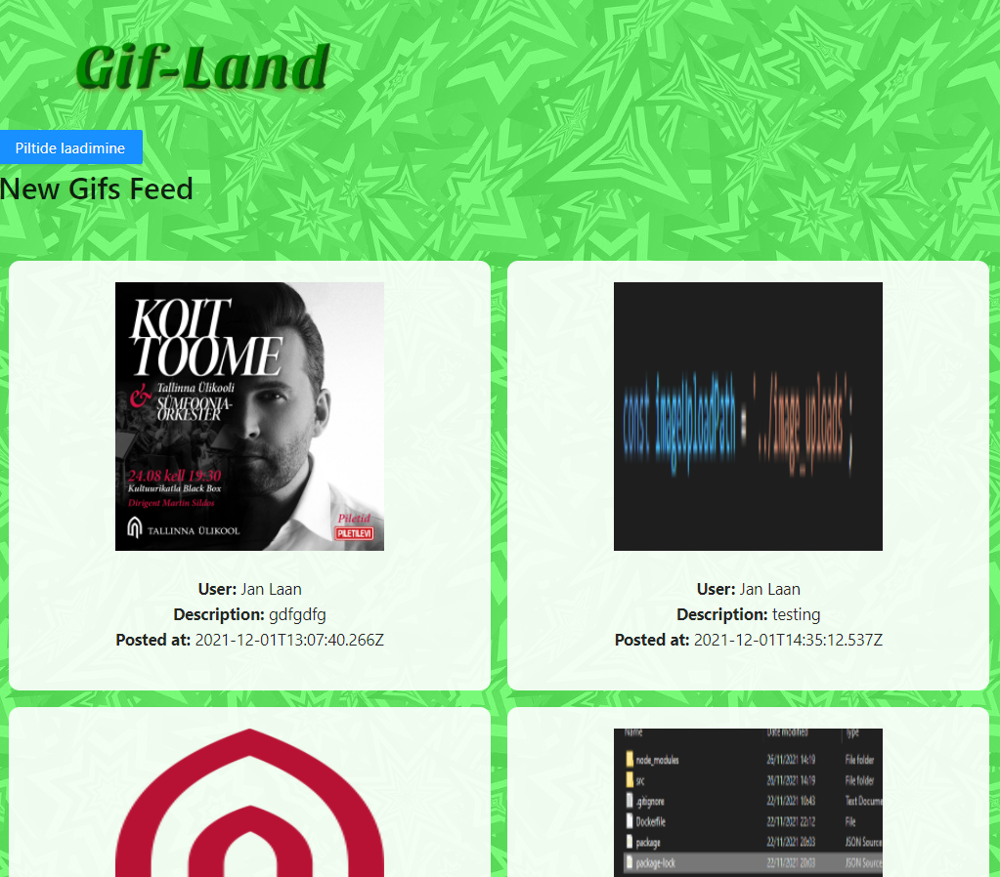
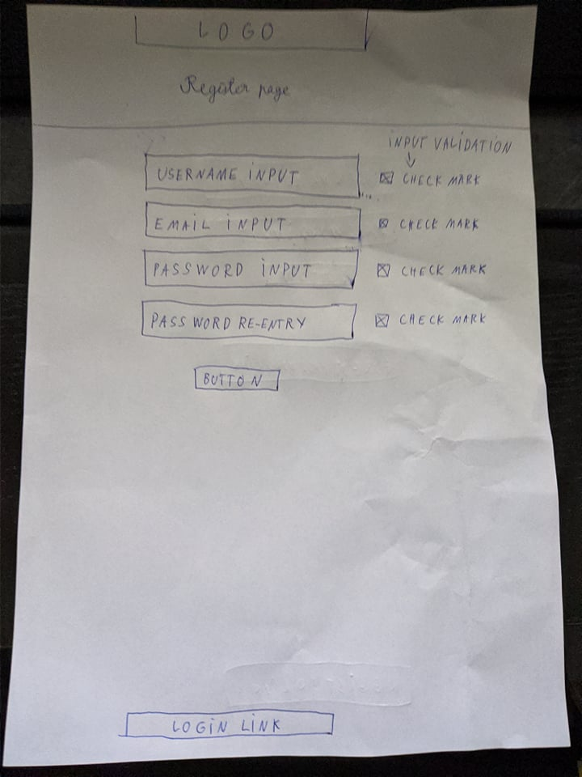

# Project Name: Gif-land
### Autorid: Hans-Märten Liiu ja Jan-Erik Läänesaar
 

Algne Idee:
-------------

Lehel eksisteerib sisse-, ja välja logimise võimalus. Kasutajad saavad üles laadida enda poolt valitud .gif failisid. Teised kasutajad saavad üksteise gif-isid meeldivaks märkida ning saavad neile omalt poolt kommentaare lisada. 
 
 
Kui arendus nende põhifunktsionaalsustega ilusti lõpuni jõuab, oleks järgmine eesmärk luua profiilide süsteem, kus saaks näha mõne konkreetse kasutaja poolt kõiki üleslaetud gif-e, ning kus saaks ka antud kasutajat jälgima hakata. Esialgses versioonis kuvame kõikide kasutajate poolt tehtud postitused ühisel lehel, küll aga oleks lõppeesmärk kuvada iga kasutaja jaoks eraldi voolehte, kus ta näeks vaid tema enda poolt jälgitud kasutajate postitusi. 
 

## Rakenduse funktsionaalne kirjeldus:
* Sisse ja välja logimise funktsionaalsus
* NavBari kaudu saab liikuda erinevate komponentide vahel
* Gif-ide Üleslaadimise funktsionaalsus (Toimib kasutades lisa serverit, mida hetkel veel peab käsitsi käivitama)
* Gif-ide kuvamise funktsionaalsus(responsive disain)
* Profiili - leht tulekul
 

## Rakenduse kuvatõmmised

 

## Wireframe kuvatõmmised

 

## Pisipildid, logod, animatsioonid jms on võetud järgnevatelt lehtedelt:
* https://www.flaticon.com/
* https://maketext.io/
* https://loading.io/css
* https://favicon.io/
* https://pixabay.com/illustrations/green-pattern-background-wallpaper-2696878/

